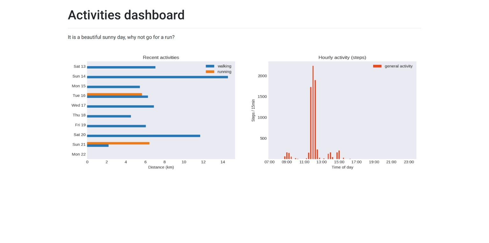

# Dashboard 
A tiny dashboard which pulls activity data from the Fitbit API and serves visualisations in Flask. 

 

Written to reinforce my knowledge of Python, SQL and Flask. 

### Project structure 
The project layers are as follows: 

* Fitbit API wrapper: A class that handles interactions with the Fitbit REST API, dealing with the token authentication/refresh process. 

* Database: A MySQL database holding the Fitbit API authentication credentials, as well as tables of fitness data.  

* Server: A class that handles communicating with the Database, and fetching/updating Fitbit API credentials. 

* Plotting module: Creates plots from database tables. 

* Flask app: Serve in a beautiful webpage and voilà! 

