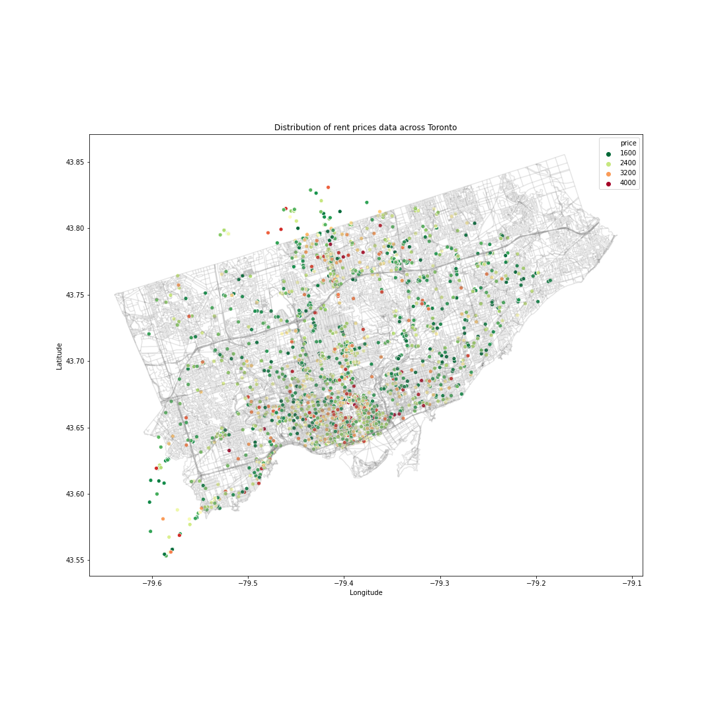

# Predicting Apartment Rent Prices in Toronto
In this Python 3 jupyter notebook we will go through an end-to-end machine learning project. Our goal is to build a predictive model of apartment rent prices in Toronto, a classic regression task. We will go through the following:

1. Data collection.
2. Data preparation & feature engineering.
3. Model selection and evaluation.
4. Deployment. 

 

The data was scraped from the rental site https://www.rentals.ca/ and consists of ~6800 data points with 13 columns:

* price (per month) 
* city
* street address
* postal code
* longitude
* latitude
* rental type
* number of bedrooms
* number of bathrooms
* sqft
* text description
* year built
* number of parking spots

See the accompanying post [here](https://vgelinas.github.io/post/predicting-toronto-rent-prices/).  
